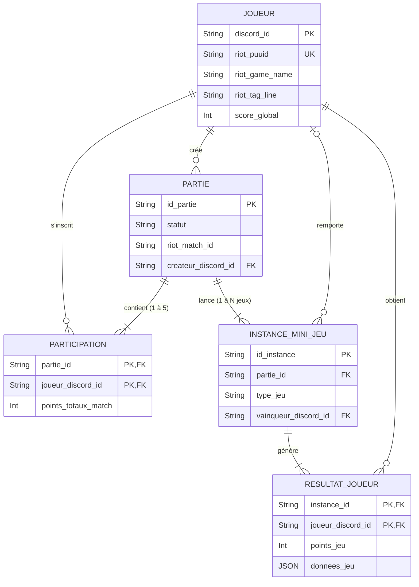

```mermaid
erDiagram
    JOUEUR {
        String discord_id PK
        String riot_puuid UK
        String riot_game_name
        String riot_tag_line
        Int score_global
    }

    PARTIE {
        String id_partie PK
        String statut
        String riot_match_id
        String createur_discord_id FK
    }

    PARTICIPATION {
        String partie_id PK, FK
        String joueur_discord_id PK, FK
        Int points_totaux_match
    }

    INSTANCE_MINI_JEU {
        String id_instance PK
        String partie_id FK
        String type_jeu
        String vainqueur_discord_id FK
    }

    RESULTAT_JOUEUR {
        String instance_id PK, FK
        String joueur_discord_id PK, FK
        Int points_jeu
        JSON donnees_jeu
    }

    %% === RELATIONS ===

    %% 1. Création de la partie
    JOUEUR ||--o{ PARTIE : "crée"

    %% 2. L'historique et le lobby
    JOUEUR ||--o{ PARTICIPATION : "s'inscrit"
    PARTIE ||--|{ PARTICIPATION : "contient (1 à 5)"

    %% 3. La liste des jeux joués pendant la partie
    PARTIE ||--|{ INSTANCE_MINI_JEU : "lance (1 à N jeux)"
    JOUEUR |o--o{ INSTANCE_MINI_JEU : "remporte"

    %% 4. Les résultats spécifiques de chaque jeu
    INSTANCE_MINI_JEU ||--|{ RESULTAT_JOUEUR : "génère"
    JOUEUR ||--o{ RESULTAT_JOUEUR : "obtient"
```