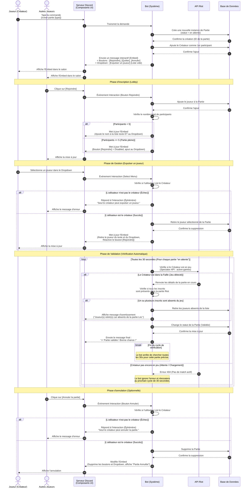

```mermaid
sequenceDiagram
    autonumber

    actor Createur as Joueur (Créateur)
    actor Autres as Autres Joueurs
    participant Discord as Serveur Discord<br/>(Composants UI)
    participant Bot as Bot (Système)
    participant API as API Riot
    participant BDD as Base de Données

    Createur->>Discord: Tape la commande<br/>(/creer-partie [type])
    Discord->>Bot: Transmet la demande
    
    Bot->>BDD: Crée une nouvelle instance de Partie<br/>(statut = en attente)
    BDD-->>Bot: Confirme la création (ID de la partie)
    Bot->>BDD: Ajoute le Créateur comme 1er participant
    BDD-->>Bot: Confirme l'ajout
    
    Bot-->>Discord: Envoie un message interactif (Embed)<br/>+ Boutons : [Rejoindre], [Quitter], [Annuler]<br/>+ Dropdown : [Expulser un joueur] (Liste vide)
    Discord-->>Createur: Affiche l'Embed dans le salon
    Discord-->>Autres: Affiche l'Embed dans le salon

    %% ==========================================
    Note over Createur, BDD: Phase d'inscription (Lobby)
    %% ==========================================

    Autres->>Discord: Clique sur [Rejoindre]
    Discord->>Bot: Événement Interaction (Bouton Rejoindre)
    
    Bot->>BDD: Ajoute le joueur à la Partie
    BDD-->>Bot: Confirme l'ajout
    Bot->>Bot: Vérifie le nombre total de participants
    
    alt Participants < 5
        Bot-->>Discord: Met à jour l'Embed<br/>(Ajoute le nom à la liste texte ET au Dropdown)
    else Participants == 5 (Partie pleine)
        Bot-->>Discord: Met à jour l'Embed<br/>(Bouton [Rejoindre] = Disabled, ajout au Dropdown)
    end
    Discord-->>Autres: Affiche la mise à jour

    %% ==========================================
    Note over Createur, BDD: Phase de Gestion (Expulser un joueur)
    %% ==========================================

    Createur->>Discord: Sélectionne un joueur dans le Dropdown
    Discord->>Bot: Événement Interaction (Select Menu)
    
    Bot->>Bot: Vérifie si l'utilisateur est le Créateur
    alt L'utilisateur n'est pas le créateur (Échec)
        Bot-->>Discord: Répond à l'interaction (Éphémère)<br/>"Seul le créateur peut expulser un joueur."
        Discord-->>Autres: Affiche le message d'erreur
    else L'utilisateur est le créateur (Succès)
        Bot->>BDD: Retire le joueur sélectionné de la Partie
        BDD-->>Bot: Confirme la suppression
        Bot-->>Discord: Met à jour l'Embed<br/>(Retire le joueur du texte et du Dropdown,<br/>Réactive le bouton [Rejoindre])
        Discord-->>Createur: Affiche la mise à jour
    end

    %% ==========================================
    Note over Createur, BDD: Phase de Validation (Vérification Automatique)
    %% ==========================================

    loop Toutes les 30 secondes (Pour chaque partie "en attente")
        Bot->>API: Vérifie si le Créateur est en jeu<br/>(Spectator API : active-games)
        
        alt Le Créateur est dans la Faille (Jeu détecté)
            API-->>Bot: Renvoie les détails de la partie en cours
            Bot->>Bot: Vérifie si tous les inscrits<br/>sont présents dans la partie Riot
            
            alt Un ou plusieurs inscrits sont absents du jeu
                Bot->>BDD: Retire les joueurs absents de la liste
                Bot-->>Discord: Affiche message d'avertissement<br/>("Joueur(s) retiré(s) car absents de la partie LoL")
            end
            
            Bot->>BDD: Change le statut de la Partie (Validée)
            BDD-->>Bot: Confirme la mise à jour
            Bot-->>Discord: Envoie le message final :<br/>"✅ Partie validée ! Bonne chance !"
            
            break Fin du cycle de vérification
                Note over Bot: Le bot arrête de chercher toutes<br/>les 30s pour cette partie précise.
            end
            
        else Créateur pas encore en jeu (Attente / Chargement)
            API-->>Bot: Erreur 404 (Pas de match actif)
            Note over Bot: Le bot ignore l'erreur et réessaiera<br/>au prochain cycle de 30 secondes.
        end
    end

    %% ==========================================
    Note over Createur, BDD: Phase d'annulation (Optionnelle)
    %% ==========================================

    Autres->>Discord: Clique sur [Annuler la partie]
    Discord->>Bot: Événement Interaction (Bouton Annuler)
    
    Bot->>Bot: Vérifie si l'utilisateur est le Créateur
    alt L'utilisateur n'est pas le créateur (Échec)
        Bot-->>Discord: Répond à l'interaction (Éphémère)<br/>"Seul le créateur peut annuler la partie."
        Discord-->>Autres: Affiche le message d'erreur
    else L'utilisateur est le créateur (Succès)
        Bot->>BDD: Supprime la Partie
        BDD-->>Bot: Confirme la suppression
        Bot-->>Discord: Modifie l'Embed<br/>(Supprime les boutons et Dropdown, affiche "Partie Annulée")
        Discord-->>Createur: Affiche l'annulation
    end
```