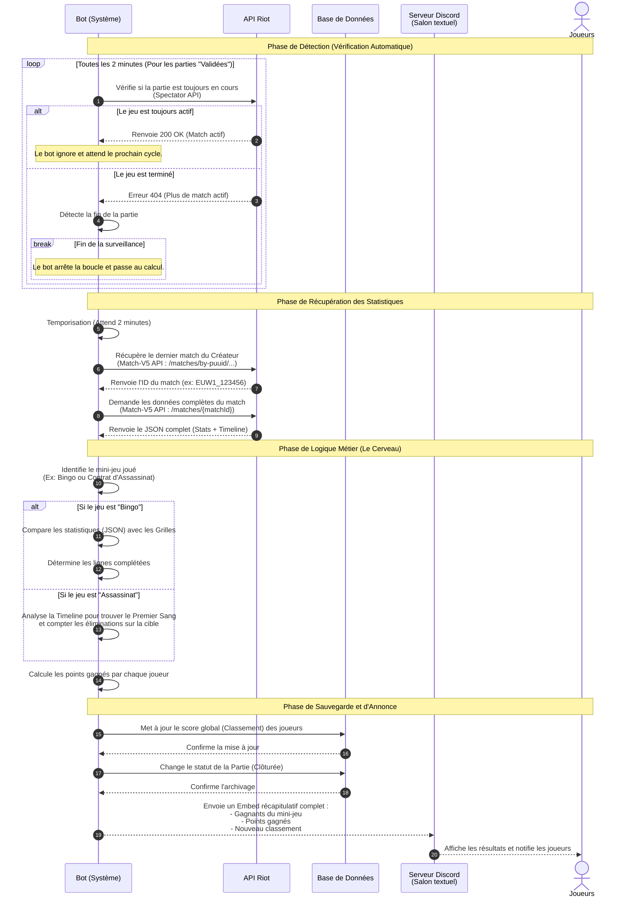

```mermaid
sequenceDiagram
    autonumber

    participant Bot as Bot (Système)
    participant API as API Riot
    participant BDD as Base de Données
    participant Discord as Serveur Discord<br/>(Salon textuel)
    actor Joueurs as Joueurs

    %% ==========================================
    Note over Bot, Joueurs: Phase de Détection (Vérification Automatique)
    %% ==========================================

    loop Toutes les 2 minutes (Pour les parties "Validées")
        Bot->>API: Vérifie si la partie est toujours en cours<br/>(Spectator API)
        
        alt Le jeu est toujours actif
            API-->>Bot: Renvoie 200 OK (Match actif)
            Note over Bot: Le bot ignore et attend le prochain cycle.
        else Le jeu est terminé
            API-->>Bot: Erreur 404 (Plus de match actif)
            Bot->>Bot: Détecte la fin de la partie
            
            break Fin de la surveillance
                Note over Bot: Le bot arrête la boucle et passe au calcul.
            end
        end
    end

    %% ==========================================
    Note over Bot, Joueurs: Phase de Récupération des Statistiques
    %% ==========================================

    %% Note technique : L'API Riot met parfois 1 à 2 minutes pour générer le JSON de fin de match.
    Bot->>Bot: Temporisation (Attend 2 minutes)

    Bot->>API: Récupère le dernier match du Créateur<br/>(Match-V5 API : /matches/by-puuid/...)
    API-->>Bot: Renvoie l'ID du match (ex: EUW1_123456)

    Bot->>API: Demande les données complètes du match<br/>(Match-V5 API : /matches/{matchId})
    API-->>Bot: Renvoie le JSON complet (Stats + Timeline)

    %% ==========================================
    Note over Bot, Joueurs: Phase de Logique Métier (Le Cerveau)
    %% ==========================================

    Bot->>Bot: Identifie le mini-jeu joué<br/>(Ex: Bingo ou Contrat d'Assassinat)

    alt Si le jeu est "Bingo"
        Bot->>Bot: Compare les statistiques (JSON) avec les Grilles
        Bot->>Bot: Détermine les lignes complétées
    else Si le jeu est "Assassinat"
        Bot->>Bot: Analyse la Timeline pour trouver le Premier Sang<br/>et compter les éliminations sur la cible
    end

    Bot->>Bot: Calcule les points gagnés par chaque joueur

    %% ==========================================
    Note over Bot, Joueurs: Phase de Sauvegarde et d'Annonce
    %% ==========================================

    Bot->>BDD: Met à jour le score global (Classement) des joueurs
    BDD-->>Bot: Confirme la mise à jour

    Bot->>BDD: Change le statut de la Partie (Clôturée)
    BDD-->>Bot: Confirme l'archivage

    Bot-->>Discord: Envoie un Embed récapitulatif complet :<br/>- Gagnants du mini-jeu<br/>- Points gagnés<br/>- Nouveau classement
    Discord-->>Joueurs: Affiche les résultats et notifie les joueurs
```