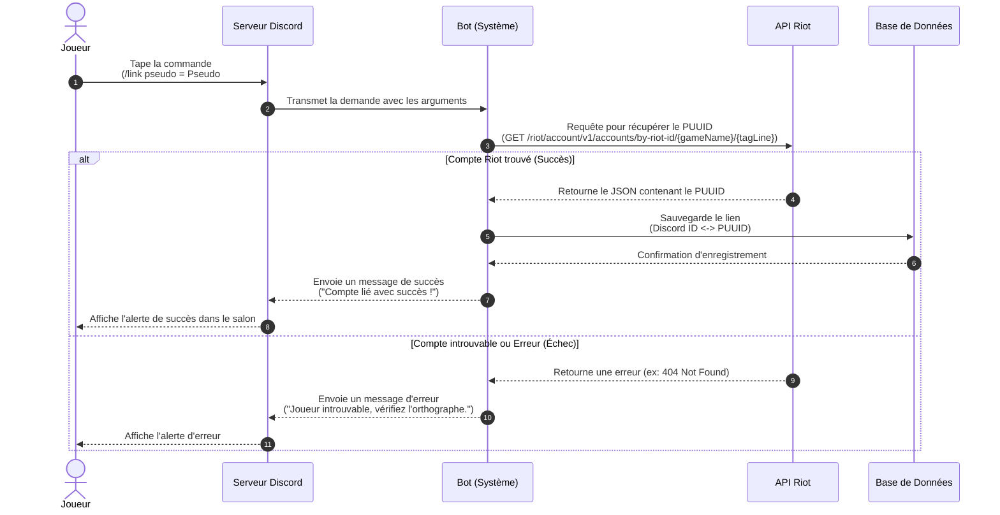

```mermaid
sequenceDiagram
    autonumber

    actor User as Joueur
    participant Discord as Serveur Discord
    participant Bot as Bot (Système)
    participant API as API Riot
    participant BDD as Base de Données

    User->>Discord: Tape la commande<br/>(/link pseudo = Pseudo#TAG)
    Discord->>Bot: Transmet la demande avec les arguments

    Bot->>API: Requête pour récupérer le PUUID<br/>(GET /riot/account/v1/accounts/by-riot-id/{gameName}/{tagLine})

    alt Compte Riot trouvé (Succès)
        API-->>Bot: Retourne le JSON contenant le PUUID
        Bot->>BDD: Sauvegarde le lien<br/>(Discord ID <-> PUUID)
        BDD-->>Bot: Confirmation d'enregistrement
        Bot-->>Discord: Envoie un message de succès<br/>("Compte lié avec succès !")
        Discord-->>User: Affiche l'alerte de succès dans le salon

    else Compte introuvable ou Erreur (Échec)
        API-->>Bot: Retourne une erreur (ex: 404 Not Found)
        Bot-->>Discord: Envoie un message d'erreur<br/>("Joueur introuvable, vérifiez l'orthographe.")
        Discord-->>User: Affiche l'alerte d'erreur
    end
```