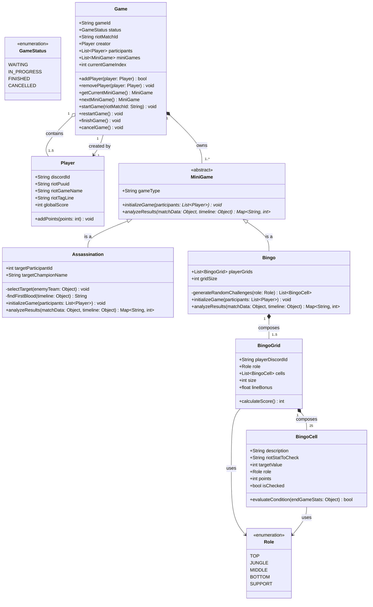

```mermaid
classDiagram

    class GameStatus {
        <<enumeration>>
        WAITING
        IN_PROGRESS
        FINISHED
        CANCELLED
    }

    class Role {
        <<enumeration>>
        TOP
        JUNGLE
        MIDDLE
        BOTTOM
        SUPPORT
    }

    class Player {
        +String discordId
        +String riotPuuid
        +String riotGameName
        +String riotTagLine
        +int globalScore
        +addPoints(points: int) void
    }

    class Game {
        +String gameId
        +GameStatus status
        +String riotMatchId
        +Player creator
        +List~Player~ participants
        +List~MiniGame~ miniGames
        +int currentGameIndex
        +addPlayer(player: Player) bool
        +removePlayer(player: Player) void
        +getCurrentMiniGame() MiniGame
        +nextMiniGame() MiniGame
        +startGame(riotMatchId: String) void
        +restartGame() void
        +finishGame() void
        +cancelGame() void
    }

    class MiniGame {
        <<abstract>>
        +String gameType
        +initializeGame(participants: List~Player~)* void
        +analyzeResults(matchData: Object, timeline: Object)* Map~String, int~
    }

    class Assassination {
        +int targetParticipantId
        +String targetChampionName
        -selectTarget(enemyTeam: Object) void
        -findFirstBlood(timeline: Object) String
        +initializeGame(participants: List~Player~) void
        +analyzeResults(matchData: Object, timeline: Object) Map~String, int~
    }

    class Bingo {
        +List~BingoGrid~ playerGrids
        +int gridSize
        -generateRandomChallenges(role: Role) List~BingoCell~
        +initializeGame(participants: List~Player~) void
        +analyzeResults(matchData: Object, timeline: Object) Map~String, int~
    }

    class BingoGrid {
        +String playerDiscordId
        +Role role
        +List~BingoCell~ cells
        +int size
        +float lineBonus
        +calculateScore() int
    }

    class BingoCell {
        +String description
        +String riotStatToCheck
        +int targetValue
        +Role role
        +int points
        +bool isChecked
        +evaluateCondition(endGameStats: Object) bool
    }

    Game "1" o-- "1..5" Player : contains
    Game "1" --> "1" Player : created by
    Game "1" *-- "1..*" MiniGame : owns

    MiniGame <|-- Assassination : is a
    MiniGame <|-- Bingo : is a

    Bingo "1" *-- "1..5" BingoGrid : composes
    BingoGrid "1" *-- "25" BingoCell : composes
    BingoGrid --> Role : uses
    BingoCell --> Role : uses
```