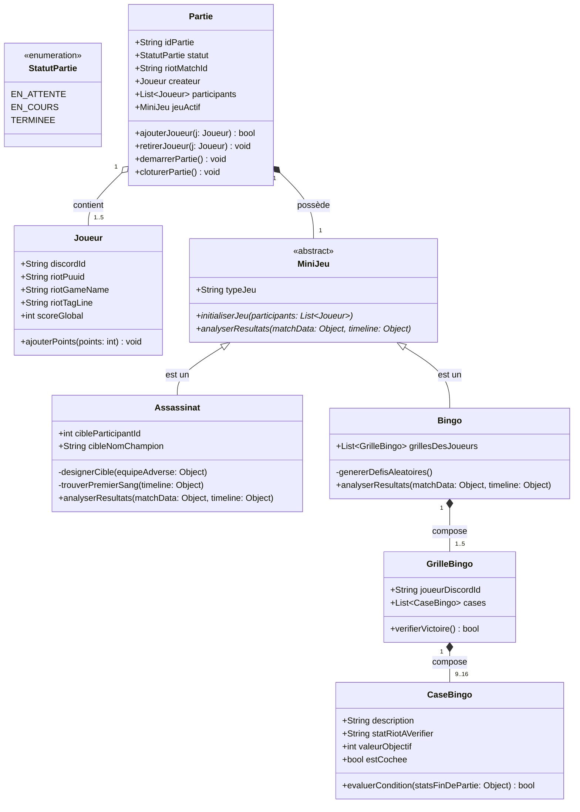

```mermaid
classDiagram

    class StatutPartie {
        <<enumeration>>
        EN_ATTENTE
        EN_COURS
        TERMINEE
    }

    class Joueur {
        +String discordId
        +String riotPuuid
        +String riotGameName
        +String riotTagLine
        +int scoreGlobal
        +ajouterPoints(points: int) void
    }

    class Partie {
        +String idPartie
        +StatutPartie statut
        +String riotMatchId
        +Joueur createur
        +List~Joueur~ participants
        +MiniJeu jeuActif
        +ajouterJoueur(j: Joueur) bool
        +retirerJoueur(j: Joueur) void
        +demarrerPartie() void
        +cloturerPartie() void
    }

    class MiniJeu {
        <<abstract>>
        +String typeJeu
        +initialiserJeu(participants: List~Joueur~)*
        +analyserResultats(matchData: Object, timeline: Object)*
    }

    class Assassinat {
        +int cibleParticipantId
        +String cibleNomChampion
        -designerCible(equipeAdverse: Object)
        -trouverPremierSang(timeline: Object)
        +analyserResultats(matchData: Object, timeline: Object)
    }

    class Bingo {
        +List~GrilleBingo~ grillesDesJoueurs
        -genererDefisAleatoires()
        +analyserResultats(matchData: Object, timeline: Object)
    }

    class GrilleBingo {
        +String joueurDiscordId
        +List~CaseBingo~ cases
        +verifierVictoire() bool
    }

    class CaseBingo {
        +String description
        +String statRiotAVerifier
        +int valeurObjectif
        +bool estCochee
        +evaluerCondition(statsFinDePartie: Object) bool
    }

    Partie "1" o-- "1..5" Joueur : contient
    Partie "1" *-- "1" MiniJeu : possède

    MiniJeu <|-- Assassinat : est un
    MiniJeu <|-- Bingo : est un

    Bingo "1" *-- "1..5" GrilleBingo : compose
    GrilleBingo "1" *-- "9..16" CaseBingo : compose
```