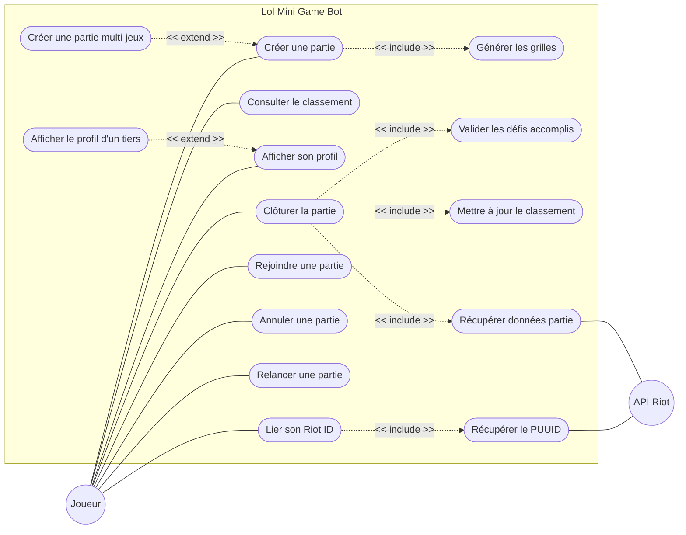

```mermaid
flowchart LR
    User((Joueur))
    API((API Riot))

    subgraph "Lol Mini Game Bot"
        direction TB
        
        %% Actions de base
        UC_Link([Lier son Riot ID])
        UC_Ladder([Consulter le classement])
        UC_Profile([Afficher son profil])
        UC_ProfileOther([Afficher le profil d'un tiers])
        
        %% Gestion de partie
        UC_Create([Créer une partie])
        UC_CreateMulti([Créer une partie multi-jeux])
        UC_Join([Rejoindre une partie])
        UC_Cancel([Annuler une partie])
        UC_Restart([Relancer une partie])
        UC_Finish([Clôturer la partie])
        
        %% Logique système
        UC_Grid([Générer les grilles])
        UC_Validate([Valider les défis accomplis])
        UC_UpdateLadder([Mettre à jour le classement])
        
        %% Actions API
        UC_Puuid([Récupérer le PUUID])
        UC_MatchData([Récupérer données partie])
    end

    %% Interactions du Joueur
    User --- UC_Link
    User --- UC_Ladder
    User --- UC_Profile
    User --- UC_Create
    User --- UC_Join
    User --- UC_Cancel
    User --- UC_Restart
    User --- UC_Finish

    %% Extensions
    UC_ProfileOther -. "<< extend >>" .-> UC_Profile
    UC_CreateMulti -. "<< extend >>" .-> UC_Create

    %% Inclusions
    UC_Link -. "<< include >>" .-> UC_Puuid
    UC_Create -. "<< include >>" .-> UC_Grid
    UC_Finish -. "<< include >>" .-> UC_MatchData
    UC_Finish -. "<< include >>" .-> UC_Validate
    UC_Finish -. "<< include >>" .-> UC_UpdateLadder

    %% Interactions avec l'API Riot
    UC_Puuid --- API
    UC_MatchData --- API
```